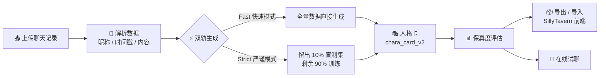

<p align="center">
  
  
  
  
</p>

# 🎭 人格卡生成工具（Chara Card Generator）

> **基于聊天记录一键生成 AI 人格卡** —— 把一段真实的对话，变成一张有语气、有性格、有记忆的虚拟角色卡。

你是否曾想把和某个人的聊天记录变成可交互的 AI 人格？这个工具帮你两步完成：上传微信导出的聊天记录 → 自动生成一张包含语气、性格、记忆的人格卡，可导入 SillyTavern 等前端，也可直接内嵌试聊。

---

## 🗺️ 项目架构



---

## ✨ 功能特性

**双上传模式**
- 文件上传 / 文本粘贴，自动解析「昵称 / 时间戳 / 内容」格式
- 自动识别说话双方昵称（按出现频次），支持手动补全与互换
- 数据健康度评分，样本单薄时主动预警

**双轨评估（Fast / Strict）**
- 快速模式：全量数据生成，评估结果为同源近似估计，适合快速预览
- 严谨模式：≥50 条对话时可选，随机留出约 10%（至多 20 条）「用户提问 → 角色回复」作为盲测集，只用剩余 90% 训练；评估只走盲测集，得分具备统计可信度

**生成与产出**
- 输出标准 **SillyTavern V2（`chara_card_v2`）** 规范 JSON
- 多格式导出：完整 JSON / 纯文本提示词版 / 简化 JSON
- 历史人格卡持久化：全部卡片写入数据库，支持查看、载入、删除，**重启不丢失**，得分回写

**试聊**
- 基于人格卡设定直接与角色对话，实时调校语气与性格

**工程能力**
- 项目导入 / 导出：ZIP 一键打包迁移（匿名化聊天记录 + 最新人格卡 + 元信息）
- 导出深度匿名化：昵称替换 + 正则脱敏（手机号 / 身份证 / 邮箱 / IP）+ 自定义敏感词过滤
- 接口限流：Flask-Limiter 按 IP 分级限流，防刷防滥用
- 数据清理：手动一键清理 + APScheduler 每日定时清理，**人格卡不受影响**
- 结构化日志：控制台 + 按天滚动文件（保留 30 天），全链路埋点、密钥与正文脱敏
- 全局异常处理：未捕获异常完整落日志，前端只收到标准 JSON 错误

---

## 🚀 快速开始

### 环境要求

- Python 3.8+
- 可访问 `api.deepseek.com` 的网络
- 一个 DeepSeek API Key（[platform.deepseek.com](https://platform.deepseek.com) 获取）

### 克隆与安装

```bash
git clone https://github.com/shiqidebw/-Chara-Card-Generator-.git
cd -Chara-Card-Generator-
pip install -r requirements.txt
```

### 运行

```bash
python app.py
```

浏览器打开 <http://127.0.0.1:5000>。

**Windows 用户**：直接双击项目目录下的 `start.bat` 即可（脚本自动选择内置/系统 Python；启动失败时窗口会停留并显示错误，详情写入 `startup_error.log`）。

### 支持的聊天记录格式

每条消息固定三行，消息之间用空行分隔（空行可省略）：

```
风碎逝
2026年08月28日 19:30
什么时候回

拾柒
2026年08月28日 19:32
我在家
```

- 第一行昵称，第二行时间戳（可忽略），第三行起为消息内容（支持多行）
- 时间戳支持 `2026年08月28日 19:30`、`2026-08-28 19:30`、`2026/08/28 19:30:12` 等常见写法
- 昵称多于两个时取出现频次最高的两个，也可在页面手动补全

### 使用流程

1. 顶部填入 DeepSeek API Key，点「测试连接」
2. 上传或粘贴聊天记录（可多次，内容自动合并）
3. 确认 User / Char 昵称映射
4. 选择快速 / 严谨模式，点「生成人格卡」
5. 复制 / 下载 / 试聊 / 评估保真度 / 导出项目

---

## ⚙️ 配置说明

所有配置通过**环境变量**或项目根目录的 **`.env` 文件**设置（复制 `.env.example` 为 `.env` 修改即可）。优先级：环境变量 > `.env` > 代码默认值。**全部为可选配置**，开箱即用。

| 配置项 | 默认值 | 说明 |
|---|---|---|
| `LOG_LEVEL` | `INFO` | 日志级别：`DEBUG` / `INFO` / `WARNING` / `ERROR` / `CRITICAL`，排障时改 `DEBUG` |
| `LOG_DIR` | `logs` | 日志目录（相对项目根，可填绝对路径） |
| `LOG_RETENTION_DAYS` | `30` | 日志按天滚动保留天数 |
| `LOG_TIMING` | `1` | 是否记录每个请求耗时（毫秒） |
| `CLEANUP_ENABLED` | `1` | 定时自动清理开关（`0` 关闭，手动清理按钮仍可用） |
| `CLEANUP_RETENTION_DAYS` | `7` | 保留天数，早于 `now - N 天` 的上传记录会被删除 |
| `CLEANUP_INTERVAL_DAYS` | `1` | 自动清理执行间隔（天） |
| `CLEANUP_ON_START` | `1` | 启动时是否先清理一次（调试 / 回溯数据可设 `0`） |
| `MESSAGE_WARN_THRESHOLD` | `10000` | 总消息数超过该值时前端提示建议清理 |
| `RATE_LIMIT_ENABLED` | `1` | **限流总开关**：`0` 彻底关闭限流（调试用） |
| `RATE_LIMIT_DEFAULT` | `200 per hour` | **全局兜底限流**，多条用逗号分隔 |
| `RATE_LIMIT_GENERATE` | `5 per minute` | `/generate_card` 限流 |
| `RATE_LIMIT_EVALUATE` | `10 per minute` | `/evaluate_card` 限流 |
| `RATE_LIMIT_UPLOAD` | `20 per minute` | `/upload` 限流 |
| `RATE_LIMIT_PROJECT_IO` | `30 per hour` | `/export_project`、`/import_project` 限流 |
| `RATE_LIMIT_STORAGE_URI` | `memory://` | 限流存储后端；多实例部署改 `redis://host:port/0` |

> 内部调试开关 `CARDTOOL_SKIP_MAINTENANCE=1`：跳过启动清理与调度器（自测导入模块时使用，一般无需关注）。

---

## 🔒 数据隐私与安全声明

**数据本地优先**
- 所有上传记录、解析结果、生成的人格卡**仅存储在本地 SQLite 数据库**（`data.db`），**不会上传至任何第三方服务器**。
- 唯一的例外是**用户主动调用 DeepSeek API**（`api.deepseek.com`）进行生成 / 评估 / 试聊——只有这些操作会把对话内容发往 DeepSeek 官方接口用于模型推理。

**API Key 保护**
- DeepSeek API Key 只存在于浏览器内存与单次 HTTP 请求中，**不写入数据库、不落盘、不转发给除 DeepSeek 之外的任何服务**。
- 日志中的 Key 一律脱敏（`sk-****yz` / `[REDACTED]`），日志不记录聊天正文。

**导出匿名化机制**
导出项目 ZIP 时执行三层清洗（**仅作用于导出副本，不改动数据库原文**）：

1. **昵称替换**：说话人昵称 →「我」/「她」
2. **正则脱敏**：手机号（11 位）、18 位身份证号、邮箱、IPv4 地址 → `[个人信息]`
3. **自定义敏感词**：导出前在「导出隐私设置」面板填写的词 → `[隐私]`（词表存本地浏览器，不随包外传）

**⚠️ 免责警告：导出包并非完全脱敏**
- 人格卡正文（`card.json`）**未做敏感词清洗**；
- 聊天正文中的称谓、事件细节、地点等**无法自动识别**，可能仍然存在；
- 请务必**自行审核**导出内容后再分享，且只分享给获得授权的对象。

**合规提醒**
- 请遵守所在地区隐私相关法律法规（如《个人信息保护法》）；
- **未经授权不得使用他人的聊天记录**，处理他人数据前请确认已获得明确同意；
- 本工具仅用于合法的、获得授权的个人用途。

---

## ⏱️ 限流规则

按**客户端 IP + 路由**独立计数，防刷防滥用：

| 路由 | 限制 | 说明 |
|---|---|---|
| 全部路由（全局兜底） | `200 per hour` | 未单独配置的路由都走这里（`/chat`、`/history` 等交互路由） |
| `/generate_card` | `5 per minute` | 每次调用 DeepSeek，成本最高 |
| `/evaluate_card` | `10 per minute` | 评估同样多次调用 DeepSeek |
| `/upload` | `20 per minute` | 防大量小文件上传攻击 |
| `/export_project` / `/import_project` | `30 per hour` | 打包 / 解包开销大 |

**触发超限（429）时的响应：**

```http
HTTP/1.1 429 Too Many Requests
Retry-After: 60

{"success": false, "error": "请求过于频繁，请稍后再试。", "retry_after": 60, "code": 429}
```

- `retry_after` = 被触发规则的窗口长度（安全上界）：分钟级规则 60 秒、小时级规则 3600 秒
- 前端会自动把秒数格式化为中文提示（如"操作太频繁，请等待 3 分钟后再试"）
- 调试时设 `RATE_LIMIT_ENABLED=0` 可彻底关闭

---

## 🌐 在线服务部署

**⚠️ 生产环境请勿使用 `python app.py`（内置开发服务器），也不要对公网直接暴露无鉴权的实例。**

### Linux + gunicorn

```bash
pip install gunicorn

# 生产入口：会自动执行启动清理并拉起定时调度器，保持单 worker
gunicorn -w 1 -b 0.0.0.0:5000 'app:serve_app()'
```

### Windows + waitress

```powershell
pip install waitress

waitress-serve --port=5000 'app:serve_app()'
```

> `serve_app()` 是生产 WSGI 入口（`app.py` 内已实现）：gunicorn / waitress 通过导入模块加载应用，不会执行 `__main__` 分支，该入口负责补跑启动清理与调度器。

### 部署注意

- **单 worker**：定时调度器是进程内线程，多 worker 会各起一份；SQLite 也不适合多进程并发写
- **反向代理 + HTTPS**：建议前置 Nginx / Caddy，并处理 `X-Forwarded-For`（限流键只认 `remote_addr`，代理场景需配置可信代理）
- **不要用 debug 模式**：`serve_app()` 不经过 `app.run(debug=True)`，天然关闭调试器
- **数据备份**：`data.db` 是全部数据所在，请定期备份（连同 `logs/`）
- **限流存储**：多实例部署把 `RATE_LIMIT_STORAGE_URI` 指向共享 Redis

---

## ❓ 常见问题

**Q：数据量不足，Strict 模式为什么不可用？**
Strict（严谨）模式要求 ≥50 条有效消息且「用户提问 → 角色回复」配对 ≥2 组，否则会自动回退到 Fast 并弹出提示。样本偏少时建议补充更多样的日常对话再试。

**Q：生成的人格卡不够像 TA？**
先看数据健康度评分，分数低说明样本单薄。补充不同场景、不同情绪的对话后重新生成，再用试聊 + 保真度评估反复调校。

**Q：导出包里的数据安全吗？**
做了三层匿名化（昵称替换 + 正则脱敏 + 自定义敏感词），但**并非完全脱敏**——`card.json` 与聊天正文里的称谓、事件细节无法自动识别，分享前请自行审核。

**Q：清理历史数据后，人格卡还在吗？**
在。`generated_cards` 的外键是 `ON DELETE SET NULL`，清理聊天记录只会解除卡片与上传批次的关联，卡片本身和评估得分都保留。

**Q：双击 start.bat 窗口一闪就关 / 网页打不开？**
新版启动脚本失败时会停留窗口并写入 `startup_error.log`。常见原因：端口 5000 被残留进程占用（先结束任务管理器里的 python 进程）、依赖缺失（`pip install -r requirements.txt`）。

**Q：提示"操作太频繁"怎么办？**
触发了接口限流，按提示等待 `retry_after` 时间即可；自己单机用觉得碍事，可把 `RATE_LIMIT_DEFAULT` 调大，或设 `RATE_LIMIT_ENABLED=0` 关闭。

---

## 📄 许可证与贡献

本项目采用 **MIT License**（仓库根目录的 `LICENSE` 文件），可自由使用、修改、分发，包括商用，但请保留版权声明。

**欢迎一切形式的贡献：**
- 🐛 使用中发现问题？开一个 Issue，附上 `logs/app.log` 或 `startup_error.log` 的相关片段
- 💡 有改进想法？直接提 PR：fork 后修改，跑通 `python _selftest_module1.py`（43 项闭环自测）即可合并
- 📖 文档、示例聊天记录样本都欢迎

---

## 🙏 致谢与技术栈

- **Flask** —— Web 框架
- **SQLite**（标准库 `sqlite3`）—— 本地数据存储
- **DeepSeek API** —— 人格卡生成 / 评估 / 试聊的模型推理
- **SillyTavern `chara_card_v2`** —— 人格卡 JSON 规范
- **APScheduler** —— 定时数据清理
- **Flask-Limiter** —— 接口限流
- **Tailwind CSS**（CDN）+ 原生 JavaScript —— 前端界面
