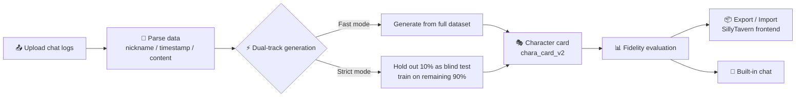

<p align="center">
  
  
  
  
</p>

<div align="center">
  <a href="README.md">中文</a> · <b>English</b>
</div>

# 🎭 Chara Card Generator

> **Turn chat logs into AI character cards in one click** — turn a real conversation into a virtual character card with tone, personality, and memory.

Ever wanted to turn your chat history with someone into an interactive AI persona? This tool does it in two steps: upload your exported chat logs → automatically generate a character card with tone, personality, and memories, ready to import into SillyTavern or chat with right away.

---

## 🗺️ Architecture



---

## ✨ Features

**Dual upload modes**
- Upload a file or paste text — automatically parses the `nickname / timestamp / content` format
- Auto-detects both speakers (by frequency), with manual override and swap
- Data health score — warns you when the sample is too thin

**Dual-track evaluation (Fast / Strict)**
- Fast mode: generates from the full dataset; evaluation is a same-source approximation, great for quick previews
- Strict mode (available with ≥ 50 messages): randomly holds out ~10% (up to 20) `user-question → character-reply` pairs as a blind test set, trains on the remaining 90%, and evaluates only on the held-out set for statistically meaningful scores

**Generation & output**
- Outputs standard **SillyTavern V2 (`chara_card_v2`)** JSON
- Multiple export formats: full JSON / plain-text prompt version / simplified JSON
- Persistent card history: every card is stored in the database — view, reload, delete, **survives restarts**, scores written back

**Built-in chat**
- Talk to the character directly using the generated card, fine-tune tone and personality in real time

**Engineering**
- Project import/export: one-click ZIP migration (anonymized chat logs + latest card + metadata)
- Deep anonymization on export: nickname replacement + regex redaction (phone / ID / email / IP) + custom sensitive-word filtering
- Rate limiting: Flask-Limiter, per-IP tiered limits against abuse
- Data cleanup: one-click manual cleanup + daily scheduled cleanup (APScheduler) — **character cards are never affected**
- Structured logging: console + daily rolling files (30-day retention), full instrumentation, secrets and message bodies redacted
- Global exception handling: every uncaught error goes to the log; the frontend only ever receives a standard JSON error

---

## 🚀 Quick Start

### Requirements

- Python 3.8+
- Network access to `api.deepseek.com`
- A DeepSeek API Key (get one at [platform.deepseek.com](https://platform.deepseek.com))

### Clone & Install

```bash
git clone https://github.com/shiqidebw/-Chara-Card-Generator-.git
cd -Chara-Card-Generator-
pip install -r requirements.txt
```

### Run

```bash
python app.py
```

Then open <http://127.0.0.1:5000> in your browser.

**Windows users**: just double-click `start.bat` in the project folder (the script auto-selects the bundled/system Python; on failure the window stays open and shows the error, with details in `startup_error.log`).

### Supported Chat Log Format

Each message is exactly three lines, separated by blank lines (blank lines optional):

```
alice
2026-08-28 19:30
are you home yet?

bob
2026-08-28 19:32
yeah, just got in
```

- Line 1: nickname; line 2: timestamp (optional); line 3+: message content (multi-line supported)
- Timestamps accept `2026年08月28日 19:30`, `2026-08-28 19:30`, `2026/08/28 19:30:12` and other common formats
- When more than two nicknames appear, the two most frequent are chosen; you can also fill them in manually on the page

### Usage Flow

1. Paste your DeepSeek API Key at the top and click "Test Connection"
2. Upload or paste chat logs (multiple times is fine — contents merge automatically)
3. Confirm the User / Char nickname mapping
4. Pick Fast or Strict mode and click "Generate Card"
5. Copy / download / chat / evaluate fidelity / export project

---

## ⚙️ Configuration

All settings are configured via **environment variables** or a **`.env` file** in the project root (copy `.env.example` to `.env` and edit). Precedence: environment variable > `.env` > code default. **Everything is optional** — it works out of the box.

| Variable | Default | Description |
|---|---|---|
| `LOG_LEVEL` | `INFO` | Log level: `DEBUG` / `INFO` / `WARNING` / `ERROR` / `CRITICAL`; use `DEBUG` when troubleshooting |
| `LOG_DIR` | `logs` | Log directory (relative to project root, or an absolute path) |
| `LOG_RETENTION_DAYS` | `30` | Days of rolling log files to keep |
| `LOG_TIMING` | `1` | Whether to log per-request duration (ms) |
| `CLEANUP_ENABLED` | `1` | Scheduled cleanup switch (`0` disables; the manual button still works) |
| `CLEANUP_RETENTION_DAYS` | `7` | Retention days — uploads older than `now - N days` get deleted |
| `CLEANUP_INTERVAL_DAYS` | `1` | Scheduled cleanup interval (days) |
| `CLEANUP_ON_START` | `1` | Clean once on startup (set `0` to keep old data for debugging) |
| `MESSAGE_WARN_THRESHOLD` | `10000` | Frontend suggests cleanup when total messages exceed this |
| `RATE_LIMIT_ENABLED` | `1` | **Master rate-limit switch**: `0` disables it completely (debugging) |
| `RATE_LIMIT_DEFAULT` | `200 per hour` | **Global fallback limit**; comma-separated for multiple rules |
| `RATE_LIMIT_GENERATE` | `5 per minute` | `/generate_card` limit |
| `RATE_LIMIT_EVALUATE` | `10 per minute` | `/evaluate_card` limit |
| `RATE_LIMIT_UPLOAD` | `20 per minute` | `/upload` limit |
| `RATE_LIMIT_PROJECT_IO` | `30 per hour` | `/export_project`, `/import_project` limit |
| `RATE_LIMIT_STORAGE_URI` | `memory://` | Rate-limit backend; use `redis://host:port/0` for multi-instance setups |

> Internal debug switch `CARDTOOL_SKIP_MAINTENANCE=1`: skips startup cleanup and the scheduler (used by the self-test; you normally don't need it).

---

## 🔒 Privacy & Security

**Data stays local**
- All uploads, parsed results, and generated character cards are stored **only in the local SQLite database** (`data.db`) and are **never uploaded to any third-party server**.
- The sole exception is **when you actively call the DeepSeek API** (`api.deepseek.com`) for generation / evaluation / chatting — only those operations send conversation content to DeepSeek's official endpoint for model inference.

**API Key protection**
- The DeepSeek API Key exists only in browser memory and within a single HTTP request: **never written to the database, never persisted, never forwarded to any service other than DeepSeek**.
- Keys in logs are always redacted (`sk-****yz` / `[REDACTED]`); log files never contain chat message bodies.

**Anonymization on export**
Exporting a project ZIP applies three layers of cleaning (**only to the export copy — the database is never modified**):

1. **Nickname replacement**: speaker nicknames → `Me` / `Her`
2. **Regex redaction**: 11-digit phone numbers, 18-digit ID numbers, emails, IPv4 addresses → `[个人信息]` (PII)
3. **Custom sensitive words**: words you add in the "Export Privacy" panel → `[隐私]` (stored in your browser only, never shipped with the archive)

**⚠️ Disclaimer: the export is NOT fully anonymized**
- The character card itself (`card.json`) is **not** cleaned against sensitive words;
- Titles, event details, locations, and other context in the chat text **cannot be auto-detected** and may remain;
- Always **review the exported content yourself** before sharing, and only share it with authorized recipients.

**Compliance**
- Follow the privacy laws of your jurisdiction (e.g., the Personal Information Protection Law / GDPR);
- **Never use someone else's chat logs without authorization** — confirm you have clear consent before processing others' data;
- This tool is intended for lawful, authorized personal use only.

---

## ⏱️ Rate Limiting

Counted per **client IP + route**, to prevent scraping and abuse:

| Route | Limit | Notes |
|---|---|---|
| All routes (global fallback) | `200 per hour` | Applies to routes without a specific rule (`/chat`, `/history`, etc.) |
| `/generate_card` | `5 per minute` | Calls DeepSeek every time — highest cost |
| `/evaluate_card` | `10 per minute` | Evaluation also calls DeepSeek repeatedly |
| `/upload` | `20 per minute` | Prevents small-file upload floods |
| `/export_project` / `/import_project` | `30 per hour` | Heavy packing/unpacking |

**Response when a limit is hit (429):**

```http
HTTP/1.1 429 Too Many Requests
Retry-After: 60

{"success": false, "error": "请求过于频繁，请稍后再试。", "retry_after": 60, "code": 429}
```

- `retry_after` = the window length of the breached rule (a safe upper bound): 60 s for per-minute rules, 3600 s for per-hour rules
- The frontend formats it into a human-friendly message automatically
- Set `RATE_LIMIT_ENABLED=0` to disable rate limiting entirely while debugging

---

## 🌐 Deployment

**⚠️ Never use `python app.py` (the built-in dev server) in production, and never expose an unauthenticated instance to the public internet.**

### Linux + gunicorn

```bash
pip install gunicorn

# Production entry: runs startup cleanup and starts the scheduler, keep single worker
gunicorn -w 1 -b 0.0.0.0:5000 'app:serve_app()'
```

### Windows + waitress

```powershell
pip install waitress

waitress-serve --port=5000 'app:serve_app()'
```

> `serve_app()` is the production WSGI entry (implemented in `app.py`): gunicorn/waitress load the app by importing the module, which skips the `__main__` block — this entry runs the startup cleanup and scheduler for you.

### Deployment notes

- **Single worker**: the scheduler is an in-process thread; multiple workers would each start one, and SQLite doesn't handle multi-process concurrent writes well
- **Reverse proxy + HTTPS**: put Nginx / Caddy in front and handle `X-Forwarded-For` (the rate-limit key only trusts `remote_addr`; configure trusted proxies)
- **No debug mode**: `serve_app()` never goes through `app.run(debug=True)`, so the debugger stays off
- **Backups**: `data.db` holds everything — back it up regularly (along with `logs/`)
- **Rate-limit storage**: point `RATE_LIMIT_STORAGE_URI` at a shared Redis for multi-instance deployments

---

## ❓ FAQ

**Q: Why is Strict mode unavailable with little data?**
Strict mode requires ≥ 50 valid messages and at least 2 `question → reply` pairs; otherwise it automatically falls back to Fast mode with a notice. Add more varied everyday conversations and try again.

**Q: The generated card doesn't feel like the person?**
Check the data health score first — a low score means the sample is thin. Add conversations from different scenarios and moods, regenerate, then fine-tune with built-in chat + fidelity evaluation.

**Q: Is the exported data safe?**
Three layers of anonymization are applied (nickname replacement + regex redaction + custom sensitive words), but it is **not fully anonymized** — titles and event details in `card.json` and the chat text can't be auto-detected. Review before sharing.

**Q: Are my character cards kept after data cleanup?**
Yes. `generated_cards` uses `ON DELETE SET NULL`, so cleanup only detaches the card from its upload batch — the card itself and its evaluation score are preserved.

**Q: The start.bat window flashes and closes / the page won't open?**
The new launcher keeps the window open on failure and writes details to `startup_error.log`. Common causes: port 5000 is held by a leftover process (end stray python processes in Task Manager first) or missing dependencies (`pip install -r requirements.txt`).

**Q: I got "too many requests" — what now?**
That's the rate limiter. Wait the `retry_after` duration, or raise `RATE_LIMIT_DEFAULT` / set `RATE_LIMIT_ENABLED=0` for personal use.

---

## 📄 License & Contributing

This project is licensed under the **MIT License** (see the `LICENSE` file in the repo root). You are free to use, modify, and distribute it, including commercially, as long as you retain the copyright notice.

**All contributions are welcome:**
- 🐛 Found a bug? Open an Issue and attach the relevant snippet from `logs/app.log` or `startup_error.log`
- 💡 Have an improvement? Submit a PR: fork, make your changes, and make sure `python _selftest_module1.py` (43-item closed-loop self-test) passes
- 📖 Docs, examples, and sample chat logs are always appreciated

---

## 🙏 Acknowledgments & Tech Stack

- **Flask** — Web framework
- **SQLite** (stdlib `sqlite3`) — local data storage
- **DeepSeek API** — model inference for generation / evaluation / chatting
- **SillyTavern `chara_card_v2`** — character card JSON spec
- **APScheduler** — scheduled data cleanup
- **Flask-Limiter** — rate limiting
- **Tailwind CSS** (CDN) + vanilla JavaScript — frontend
